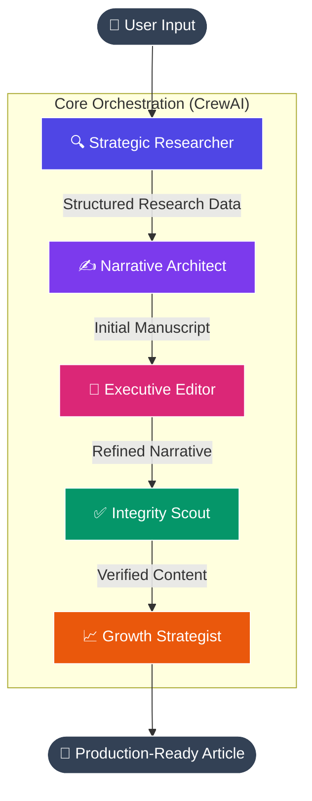

# 🚀 NarrativeNexus
### *The Enterprise-Grade Multi-Agent Editorial Engine*

[](https://github.com/nadir-sheikh09)
[](https://www.crewai.com/)
[](https://www.deepseek.com/)
[](#-the-intelligence-nexus)
[](LICENSE)

---

## ✒️ Executive Summary
**NarrativeNexus** is a production-ready, decentralized multi-agent system designed to mirror the workflow of a high-performance digital newsroom. Built on a foundation of **Sequential Reasoning** and **Strategic Context Handoffs**, NarrativeNexus orchestrates five specialized AI agents to transform raw topics into publication-ready, SEO-optimized, and fact-verified intelligence reports.

Unlike traditional LLM wrappers, NarrativeNexus employs a **Modular Agentic Architecture**, ensuring each piece of content undergoes rigorous research, drafting, executive editing, and integrity verification before final delivery.

---

## 🏗️ Technical Architecture: The Intelligence Pipeline
NarrativeNexus utilizes a sequential process where each agent serves as a node in a professional editorial graph. The output of one agent becomes the foundational context for the next, minimizing hallucinations and maximizing depth.



---

## 🛠️ The Intelligence Nexus: Agent Personas
| Agent | Role | Strategic Objective |
| :--- | :--- | :--- |
| **Strategic Researcher** | Data Acquisition | Discover high-authority sources and cross-reference real-time statistics. |
| **Narrative Architect** | Synthesis & Writing | Construct compelling narratives using proven storytelling frameworks. |
| **Executive Editor** | Quality Governance | Refine tone, improve structural flow, and ensure brand voice consistency. |
| **Integrity Scout** | Verification | Rigorous fact-checking against external search tools to ensure 100% accuracy. |
| **Growth Strategist** | SEO & Engagement | Optimize for search intent, keyword density, and strategic distribution. |

---

## 🌟 Premium Features
- **🎯 Dynamic Neural Engine Selection**: Switch between **DeepSeek-V3**, **GPT-4o**, and **Claude 3.5 Sonnet** directly from the UI.
- **💎 Glassmorphism Dashboard**: A premium, high-end Streamlit interface designed for modern enterprise workflows.
- **📊 Production Analytics**: Real-time metrics on word velocity, agent sequential steps, and production duration.
- **⭐ Governance Module**: Integrated quality scoring system with linguistic clarity and logical structure metrics.
- **📜 Version Ledger**: Immutable SQLite-backed history tracking for all generated narratives.
- **🛡️ Enterprise Security**: Built-in authentication layer and secure environment variable management.

---

## 🚀 Quick Start & Deployment

### 📋 Prerequisites
- Python 3.12+
- Docker (Optional)
- DeepSeek / OpenAI / Anthropic API Keys

### 🛠️ Local Installation
```bash
# 1. Clone the repository
git clone https://github.com/nadir-sheikh09/NarrativeNexus.git
cd NarrativeNexus

# 2. Virtual Environment Setup
python -m venv venv
source venv/bin/activate  # Windows: .\venv\Scripts\activate

# 3. Dependencies
pip install -r requirements.txt
```

### ⚙️ Configuration
Create a `.env` file in the root directory:
```env
# Multi-Model Support
DEEPSEEK_API_KEY=your_key_here
OPENAI_API_KEY=your_key_here
ANTHROPIC_API_KEY=your_key_here

# Application Settings
ENABLE_AUTH=true
APP_USERNAME=admin
APP_PASSWORD=admin
APP_SECRET_KEY=your_secure_random_string
```

### 🏃 Execution
```bash
streamlit run app.py
```

---

## 🗺️ Product Roadmap
- [ ] **Multi-Modal Integration**: Automated image generation for articles via Flux.1 / DALL-E 3.
- [ ] **Vector Memory (RAG)**: Integration with Pinecone to allow agents to "remember" brand-specific style guides.
- [ ] **CMS Gateways**: One-click deployment to WordPress, Ghost, and Substack APIs.
- [ ] **Real-time Collaboration**: WebSocket integration for multi-user editorial sessions.

---

## 🤝 Contribution Guidelines
We follow a strict **Feature-Branch** workflow. Professional PRs with unit tests are prioritized.
1. Fork the repo.
2. Create your feature branch (`git checkout -b feature/ScaleEnhancement`).
3. Commit follows Conventional Commits specification.
4. Push and open a PR.

---

## 📄 License & Attribution
Distributed under the MIT License.
*Check out my other agentic frameworks on [GitHub](https://github.com/nadir-sheikh09).*

⭐ **Star NarrativeNexus if it powers your content strategy!**
